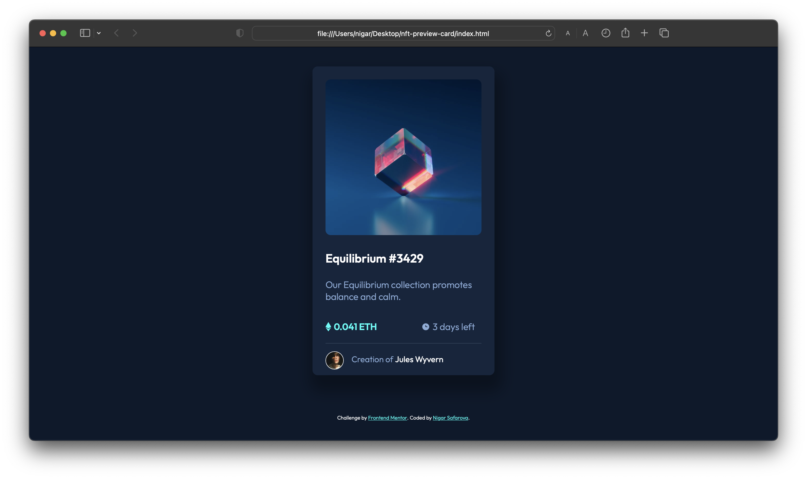
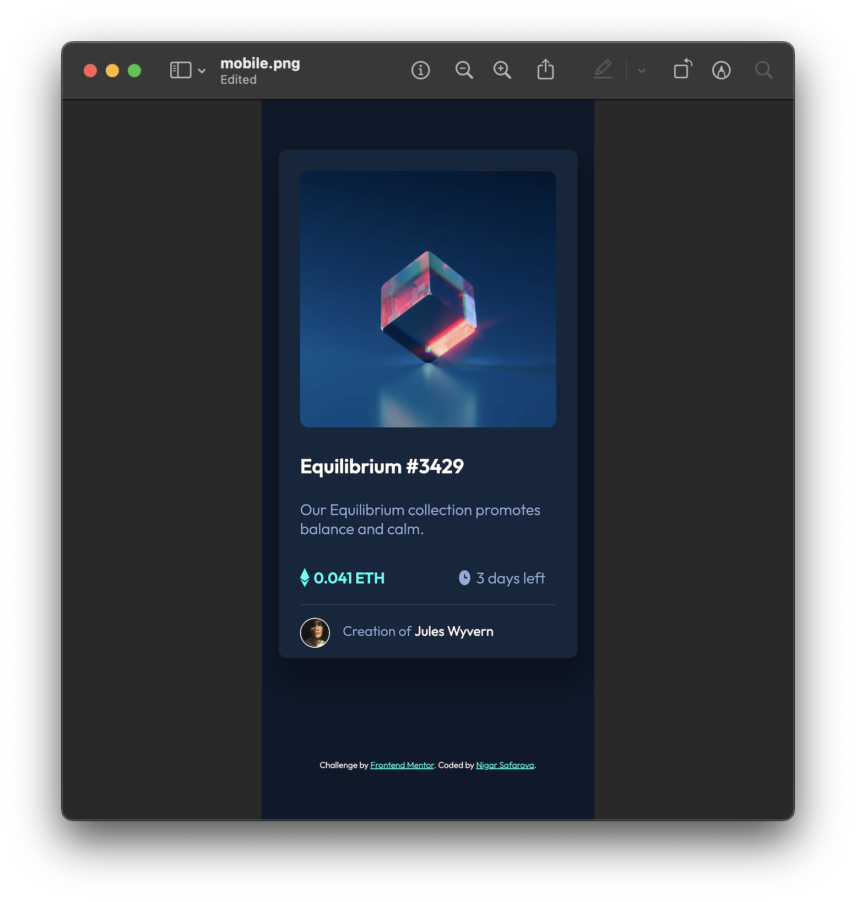

# Frontend Mentor - NFT preview card component solution

This is a solution to the [NFT preview card component challenge on Frontend Mentor](https://www.frontendmentor.io/challenges/nft-preview-card-component-SbdUL_w0U). 

Frontend Mentor challenges help you improve your coding skills by building realistic projects. 

## Table of contents

- [Overview](#overview)
  - [The challenge](#the-challenge)
  - [Screenshot](#screenshot)
  - [Links](#links)
- [My process](#my-process)
  - [Built with](#built-with)
  - [Useful resources](#useful-resources)
- [Author](#author)

## Overview

### The challenge

Users should be able to:

- View the optimal layout depending on their device's screen size
- See hover states for interactive elements

### Links

- Solution URL: [view solution page](https://your-solution-url.com)
- Live Site URL: [view live demo](https://nsafarova.github.io/nft-preview-card-component/)

### Screenshot

## My process

### Built with

- Semantic HTML5 markup
- CSS custom properties
- Flexbox

### Useful resources

- [Media queries for responsive design](https://www.w3schools.com/css/css_rwd_mediaqueries.asp) - This helped me for building mobile version of th eproject. I really liked this pattern and will use it going forward.

## Author

- Frontend Mentor Profile - [@nsafarova](https://www.frontendmentor.io/profile/nsafarova)

Thanks for reading. Peace out!✌🏼🌈
